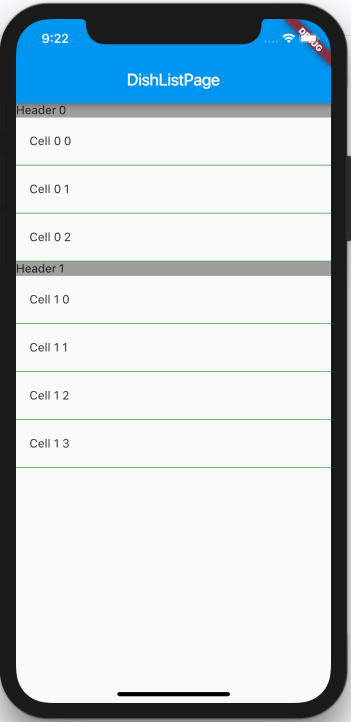

# flutter_section_table_view

A iOS like table view including section, row, section header and divider

## Usage

```dart
SectionTableView(
    sectionCount: 2,
    numOfRowInSection: (section) {
      return section == 0 ? 3 : 4;
    },
    cellAtIndexPath: (section, row) {
      return ListTile(
        leading: Text('Cell $section $row'),
      );
    },
    headerInSection: (section) {
      return Container(
        color: Colors.grey,
        child: Text('Header $section'),
      );
    },
    divider: Container(
      color: Colors.green,
      height: 0.5,
    ),
);
```




## Getting Started

For help getting started with Flutter, view our online [documentation](https://flutter.io/).

For help on editing package code, view the [documentation](https://flutter.io/developing-packages/).
