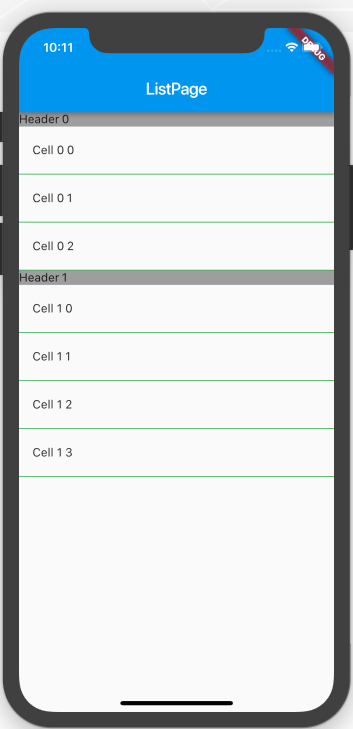
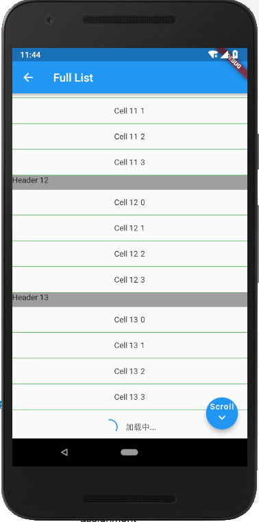

# flutter_section_table_view

A iOS like table view including section, row, section header and divider

and you can animate/jump to specific index path

## Usage

```dart
SectionTableView(
        sectionCount: 10,
        numOfRowInSection: (section) {
          return section == 0 ? 3 : 4;
        },
        cellAtIndexPath: (section, row) {
          return Container(
            height: 44.0,
            child: Center(
              child: Text('Cell $section $row'),
            ),
          );
        },
        headerInSection: (section) {
          return Container(
            height: 25.0,
            color: Colors.grey,
            child: Text('Header $section'),
          );
        },
        divider: Container(
          color: Colors.green,
          height: 1.0,
        ),
        controller: controller,//SectionTableController
        sectionHeaderHeight: (section) => 25.0,
        dividerHeight: () => 1.0,
        cellHeightAtIndexPath: (section, row) => 44.0,
      );
```

and you can animate/jump to corresponding indexPath by `calling controller.animateTo(2, 3)`


| iOS | android |
| --- | ------- |
|  | |


## Getting Started

For help getting started with Flutter, view our online [documentation](https://flutter.io/).

For help on editing package code, view the [documentation](https://flutter.io/developing-packages/).
